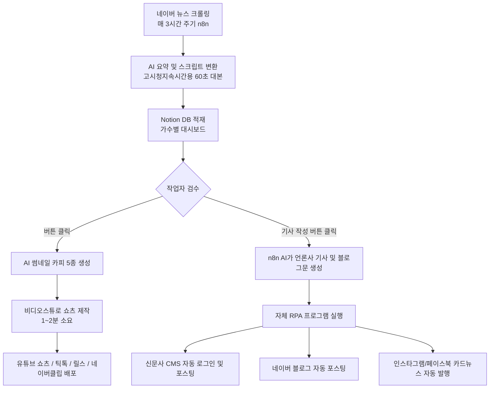

# 트로트 AI 콘텐츠 자동화 3개 영상 정밀 분석 보고서

---

## 1. 개요 및 3개 영상의 연계성

본 분석은 트로트 콘텐츠 비즈니스 및 AI 자동화 파이프라인을 다룬 3개의 유튜브 영상에 대한 정밀 분석입니다.

* **영상 1 (`Hu9DICdub7I`)**: 트로트 전문 9개 채널 및 언론사 '트론매거진' 운영자 남시우(38세) 대표의 비즈니스 모델, 성공 스토리, 전체 시스템 아키텍처 및 수익 구조 소개.
* **영상 2 (`XlM_d3OU3gE`)**: 남시우 대표("멀티남")의 실제 일일 작업 워크플로우(n8n + 노션 + 비디오스튜 + 자체 RPA 프로그램) 및 OSMU(One Source Multi-Use) 상세 시연.
* **영상 3 (`PHWhkV8N3gw`)**: 남시우 대표의 대만인 아내(슈아)와 50대 초보 수강생들의 실제 활용 사례, 간이 제작 프로그램 UI/UX 및 블로그 자동화 실전 운영.

---

## 2. 핵심 비즈니스 모델 및 시장성 분석

### 2.1. 타깃 고객 및 시장 특성
1. **5070 시니어 여성 팬덤**:
   - 자녀 독립 및 경제적 여유(국민연금, 자산 등)를 갖춘 세대로 시간적 여유가 많음.
   - 트로트 가수를 자식이나 손주처럼 아끼는 ‘엄마의 마음’으로 콘텐츠를 소비.
   - **압도적인 시청 지속 시간**: 58초~1분 10초 쇼츠 영상의 평균 시청 시간이 52초~57초(시청률 78~100% 이상). 보았던 영상을 재시청하고 공유하며, 자발적 슈퍼챗/후원 및 선플 문화가 정착됨.
2. **시장 공급 부족 (블루오션)**:
   - 콘텐츠 제작 능력을 갖춘 20~40대 크리에이터들은 트로트 장르에 관심이 적고 K-POP, 드라마, 이슈 등에 집중되어 있음.
   - 50~70대 인구는 2,000만 명을 돌파했으나 양질의 트로트 소식 콘텐츠 공급은 현저히 부족.
   - 서바이벌 오디션 프로그램(미스터트롯, 불타는 트롯맨, 현역가왕 등)을 통해 매년 새로운 무명/신인 가수가 계속 쏟아져 나와 소재 고갈 위험이 없음.

### 2.2. 수익 창출 구조 (다각화 파이프라인)
1. **유튜브 애드센스 (조회수 수익)**:
   - 월 1,000만 ~ 2,500만 원 (애드센스 계정 3개 분산 운영, 2년 누적 약 4억 원 달성).
2. **자체 인터넷 신문사 ('트론매거진') 구글 애드센스**:
   - 신문사 등록(정식 언론사) 후 기사 내 배너 광고로 월 $900+ (약 120만 원 이상) 추가 창출. 네이버 뉴스 제휴 심사 통과 시 트래픽 폭증 기대.
3. **네이버 블로그 (애드포스트)**:
   - 월 50만 ~ 120만 원 (일일 2.5만 ~ 4만 원).
4. **직접 광고 및 협찬 (PPL / 배너 / 대행)**:
   - 단가표: 쇼츠 1건 20만 원 / 피드 1건 10만 원 / 기사 1건 15만 원 / 롱폼 35만 원 / 배너 120만 원 / 패키지 300~400만 원.
   - 타깃 맞춤형 광고주: 시니어 패키지 여행사(200만 원), 피부과/성형외과 리프팅·보톡스(400만 원), 건강기능식품, 정수기/가전 렌탈, 트로트 소속사의 음원/가수 홍보.
   - 대기업 턴키 계약 시 9개 채널 패키지 2,700만 원 규모 수주.

---

## 3. 세부 기술 스택 및 자동화 파이프라인 구조

### 3.1. 기술 스택
- **데이터 파이프라인 및 트리거**: `n8n` (자폭성 워크플로우 자동화 도구)
- **중앙 데이터베이스 및 대시보드**: `Notion` (노션 DB)
- **자연어 처리 (LLM)**: `ChatGPT / Claude API` (쇼츠 대본, 썸네일 카피, 기사체/블로그체 변환)
- **영상 편집 및 제작**: `VideoStew (비디오스튜)` (텍스트 기반 자동 슬라이드/음성 합성/자막 생성 툴)
- **웹/데스크톱 자동화 (RPA)**: Python 기반 웹 브라우저 자동화 (Selenium / Playwright 추정) - 인간 입력 모방(Human-like typing) 적용

---

### 3.2. 단계별 콘텐츠 생산 워크플로우 (OSMU)

#### [Step 1] 소재 자동 발굴 및 대본화 (n8n + AI)
- 다루는 가수 목록(임영웅, 박서진, 김용빈, 이찬원, 영탁, 송가인, 홍지윤 등)을 설정.
- n8n이 3시간마다 네이버 뉴스를 크롤링하여 최신 기사를 수집.
- 프롬프트를 통해 기사를 60초 내외의 시청 지속시간 최적화 쇼츠 대본으로 자동 가공 후 노션 DB에 저장.

#### [Step 2] 썸네일 후킹 카피 추천
- 노션에서 ‘썸네일 생성’ 버튼 클릭 -> n8n 웹훅이 LLM을 호출하여 클릭률(CTR)이 가장 높은 5가지 패턴의 썸네일 제목을 추천.
- 특징: 궁금증 유발(결과를 미리 말하지 않음), 자극적 어그로(예: "김성주가 전한 한 마디", "전국민 울린 충격적인 한 마디").

#### [Step 3] 영상 제작 (VideoStew 활용법)
- 스크립트 복사 후 비디오스튜에 붙여넣고 문장별 슬라이드 자동 생성.
- **5070 썸네일 디자인 공식**:
  - 2줄 텍스트 (상단 파란색 계열, 하단 노란색 계열 등 고대비 색상).
  - 글씨 크기를 아주 크게 설정하여 가독성 극대화.
  - **가수의 얼굴을 자막이나 제목이 절대 가리지 않도록 배치**.
- **수익 정지(재사용 콘텐츠) 방지 꿀팁**:
  - 가수 사진만 슬라이드로 넘어가면 AI 양산형 콘텐츠로 분류되어 수익 정지 위험.
  - 중간에 네티즌 반응/여론 설명 구간에 **무료 스톡 영상(키보드 타이핑, 환호하는 군중 등)**을 1~2개 필수 삽입.
- 소요 시간: 1편당 5~7분 (숙련 시 1~2분).

#### [Step 4] 다채널 원클릭 퍼블리싱 (RPA 봇)
- 노션에서 '기사 작성' 버튼 클릭 -> 대본을 팬덤 친화적 기사 및 블로그 포스팅 글로 자동 확장.
- 자체 개발한 데스크톱 프로그램에서 '새로고침' 후 '전체 선택 -> 자동화 실행' 클릭.
- 봇이 직접 브라우저를 띄워 아이디/비밀번호를 입력하고 마우스/키보드 타이핑을 모방하여 로그인 후 본문, 소제목, 링크를 등록:
  - 언론사 관리자 페이지: 42초 만에 기사 2개 등록 완료.
  - 네이버 블로그: 이미지, 소제목, 폰트 스타일, 중앙 정렬, 신문사 링크 포함 자동 등록.
  - 메타(페이스북, 인스타그램): 썸네일 기반 카드뉴스 이미지 생성 및 캡션 자동 게시.
- 결과: **1개 소재로 10분 만에 4~5개 플랫폼 동시 배포. 하루 2시간 작업으로 약 200개 콘텐츠 생산.**

---

## 4. 영상별 핵심 분석 요약표

| 구분 | 영상 1 (`Hu9DICdub7I`) | 영상 2 (`XlM_d3OU3gE`) | 영상 3 (`PHWhkV8N3gw`) |
| :--- | :--- | :--- | :--- |
| **영상 제목** | "이건 아무도 모를걸요?" 트로트로 직장 나와서 월 3,000만 원 버는 38세 | 월 1500! 트로트 자동화로 하루 2시간 일하고 4억 번 39세의 비법 | "AI로 하루 15분이면 해요" 트로트 쇼츠로 월 150만원 버는 외국인 주부 |
| **주요 화자** | 남시우 대표 (트론매거진/영웅대학) | 남시우 대표 ("멀티남") | 슈아 (아내, 대만인 주부) & 남시우 |
| **주요 관점** | 창업 스토리, 비즈니스 철학, 언론사 설립, 거시적 시스템 | n8n / 노션 / 비디오스튜 / RPA 실제 제작 화면 정밀 시연 | 초보자 관점 실습, 간이 프로그램 시연, 50대 수강생 성공 사례 |
| **일일 작업량** | 2시간 30분 (쇼츠 40, 기사 25, 블로그 25, 카드뉴스 25) | 2시간 (총 200개 콘텐츠 발행) | 15~30분 (하루 1~4개 제작) |
| **핵심 팁** | 공정 사용 원칙 준수, 팬덤을 대학생처럼 브랜딩 (영웅대학) | 썸네일 색상 배합(파랑+노랑), 스톡 영상 삽입으로 수익정지 방지 | 초보자용 컴퓨터 기본기 교육, 단일 링크로 대본·썸네일·영상 원스톱 |
| **월 수익** | 1,500만 ~ 3,000만 원 (2년 누적 4억) | 1,500만 ~ 2,500만 원 + 협찬 300~400만 원 | 주부 부업 월 100만~150만 원 (수강생 2달 만에 구독자 3만) |

---

## 5. 프로젝트 (`tro`) 구현을 위한 기술적 시사점

1. **크롤링 모듈**:
   - 네이버 뉴스 검색 API 또는 BeautifulSoup/Playwright를 이용한 실시간 트로트 가수별 뉴스 수집기 구현.
2. **프롬프트 엔지니어링 모듈**:
   - 뉴스 본문 -> 60초 쇼츠 대본(기-승-전-결, 3초 후킹, 시청 지속시간 최적화).
   - 썸네일 후킹 제목 5종 생성 프롬프트.
   - 뉴스 기사체(신문사용) 및 블로그 포스팅용(친근한 어조, 이모지, 소제목) 변환 프롬프트.
3. **영상 자동화 모듈**:
   - 비디오스튜 API 또는 Python 기반 비디오 합성 스크립트(MoviePy, Edge-TTS, FFmpeg)를 통한 슬라이드 쇼츠 생성.
   - 스톡 비디오 클립 오버레이 기능 탑재.
4. **RPA / 자동 포스팅 모듈**:
   - 네이버 블로그 자동 로그인 및 스마트에디터 포스팅 자동화.
   - 워드프레스/CMS 자동 포스팅 API 연동.
